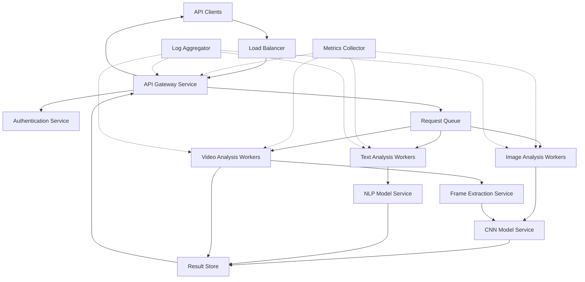

# Design Document: Aegis AI Content Safety API

## Overview

Aegis AI is a cloud-based content moderation system that provides real-time safety analysis for images, videos, and text through a REST API. The system uses pre-trained machine learning models (CNNs for images, transformers for text) to generate risk scores and moderation recommendations. The architecture follows a microservices pattern with separate services for API handling, content analysis, and infrastructure management.

The system is designed for horizontal scalability, supporting auto-scaling based on request volume. It provides sub-2-second response times for images and text, and sub-10-second response times for short videos. The API follows REST principles with JSON request/response formats and API key authentication.

## Architecture

### High-Level Architecture



### Service Responsibilities

1. **API Gateway Service**: Handles HTTP requests, request validation, response formatting, and client communication
2. **Authentication Service**: Validates API keys, enforces rate limits, manages client configurations
3. **Request Queue**: Decouples API from workers, enables load distribution and retry logic
4. **Analysis Workers**: Process content through ML models, compute risk scores, determine moderation actions
5. **Model Services**: Host ML models, provide inference endpoints, handle model versioning
6. **Result Store**: Temporary storage for analysis results, enables async processing patterns
7. **Metrics Collector**: Aggregates performance metrics, tracks SLAs, monitors system health
8. **Log Aggregator**: Centralizes logs from all services, enables debugging and audit trails

### Deployment Model

The system deploys on cloud infrastructure (AWS, GCP, or Azure) using containerized services orchestrated by Kubernetes. Each service type runs in separate pods with independent scaling policies:

- API Gateway: Scales based on request rate
- Analysis Workers: Scale based on queue depth
- Model Services: Scale based on inference latency

Auto-scaling policies trigger when metrics exceed thresholds (e.g., queue depth > 100, CPU > 70%, response time > SLA).

## Components and Interfaces

### API Gateway Service

**Responsibilities:**
- Accept HTTP requests from clients
- Validate request format and content
- Authenticate API keys
- Enqueue moderation requests
- Poll for results and return responses
- Handle errors and timeouts

**Key Interfaces:**

```python
class ModerationRequest:
    request_id: str
    api_key: str
    content_type: ContentType  # IMAGE, TEXT, VIDEO, MULTIMODAL
    content: Union[ImageContent, TextContent, VideoContent, MultimodalContent]
    thresholds: Optional[ThresholdConfig]

class ModerationResponse:
    request_id: str
    overall_risk_score: float  # 0.0 - 1.0
    recommended_action: ModerationAction  # APPROVE, REVIEW, REJECT
    content_analyses: List[ContentAnalysis]
    processing_time_ms: int
    timestamp: datetime

class ContentAnalysis:
    content_type: ContentType
    risk_score: float
    detected_categories: List[CategoryScore]
    confidence: float

class CategoryScore:
    category: str  # e.g., "violence", "hate_speech", "nudity"
    score: float
    confidence: float
```

**REST Endpoints:**

```
POST /v1/moderate
  Request Body: ModerationRequest (JSON)
  Response: ModerationResponse (JSON)
  Status Codes: 200 (success), 400 (bad request), 401 (unauthorized), 
                422 (unprocessable), 429 (rate limit), 500 (server error)

POST /v1/configure/thresholds
  Request Body: ThresholdConfig (JSON)
  Response: ConfigurationResponse (JSON)
  Status Codes: 200 (success), 400 (bad request), 401 (unauthorized)

GET /v1/health
  Response: HealthStatus (JSON)
  Status Codes: 200 (healthy), 503 (unhealthy)
```

### Authentication Service

**Responsibilities:**
- Validate API keys against client registry
- Enforce rate limits per client tier
- Load client-specific threshold configurations
- Track usage metrics per client

**Key Interfaces:**

```python
class AuthenticationService:
    def validate_api_key(api_key: str) -> AuthResult
    def check_rate_limit(api_key: str) -> RateLimitResult
    def get_client_config(api_key: str) -> ClientConfig
    def record_request(api_key: str, request_id: str) -> None

class AuthResult:
    valid: bool
    client_id: str
    tier: SubscriptionTier  # FREE, BASIC, PREMIUM, ENTERPRISE
    error_message: Optional[str]

class RateLimitResult:
    allowed: bool
    remaining_requests: int
    reset_time: datetime
    retry_after_seconds: Optional[int]

class ClientConfig:
    client_id: str
    default_thresholds: ThresholdConfig
    custom_categories: List[str]
    max_content_size_mb: int
```

### Content Analysis Workers

**Image Analysis Worker:**

```python
class ImageAnalysisWorker:
    def process_image(image_data: bytes, request_id: str) -> ImageAnalysisResult
    
class ImageAnalysisResult:
    risk_score: float
    detected_categories: List[CategoryScore]
    model_version: str
    inference_time_ms: int
```

**Text Analysis Worker:**

```python
class TextAnalysisWorker:
    def process_text(text: str, request_id: str) -> TextAnalysisResult

class TextAnalysisResult:
    risk_score: float
    detected_categories: List[CategoryScore]
    flagged_spans: List[TextSpan]  # Specific problematic text segments
    model_version: str
    inference_time_ms: int

class TextSpan:
    start_index: int
    end_index: int
    text: str
    category: str
    score: float
```

**Video Analysis Worker:**

```python
class VideoAnalysisWorker:
    def process_video(video_data: bytes, request_id: str) -> VideoAnalysisResult
    def extract_frames(video_data: bytes, interval_seconds: float) -> List[Frame]
    def aggregate_frame_scores(frame_results: List[ImageAnalysisResult]) -> float

class VideoAnalysisResult:
    risk_score: float  # Aggregate score
    frame_count: int
    high_risk_frames: List[FrameAnalysis]
    detected_categories: List[CategoryScore]
    processing_time_ms: int

class FrameAnalysis:
    frame_number: int
    timestamp_seconds: float
    risk_score: float
    detected_categories: List[CategoryScore]
```

### Model Services

**CNN Model Service (Images):**

```python
class CNNModelService:
    def predict(image_tensor: Tensor) -> ModelPrediction
    def preprocess_image(image_data: bytes) -> Tensor
    def get_model_info() -> ModelInfo

class ModelPrediction:
    category_scores: Dict[str, float]  # category -> probability
    embedding: Optional[List[float]]
    inference_time_ms: int
```

**NLP Model Service (Text):**

```python
class NLPModelService:
    def predict(text: str) -> ModelPrediction
    def tokenize(text: str) -> List[Token]
    def get_model_info() -> ModelInfo

class Token:
    text: str
    start_index: int
    end_index: int
    token_id: int
```

### Threshold Configuration

```python
class ThresholdConfig:
    approval_threshold: float  # Risk scores below this -> APPROVE
    rejection_threshold: float  # Risk scores above this -> REJECT
    # Scores between approval and rejection -> REVIEW
    
    def validate(self) -> ValidationResult:
        # Ensure 0.0 <= approval < rejection <= 1.0
        pass
    
    def determine_action(risk_score: float) -> ModerationAction:
        if risk_score < self.approval_threshold:
            return ModerationAction.APPROVE
        elif risk_score > self.rejection_threshold:
            return ModerationAction.REJECT
        else:
            return ModerationAction.REVIEW
```

### Request Queue

The system uses a message queue (e.g., RabbitMQ, AWS SQS) to decouple API requests from processing:

```python
class RequestQueue:
    def enqueue(request: ModerationRequest, priority: int) -> str  # Returns message_id
    def dequeue(worker_type: WorkerType) -> Optional[ModerationRequest]
    def acknowledge(message_id: str) -> None
    def requeue(message_id: str, delay_seconds: int) -> None
```

### Result Store

Temporary storage for analysis results (e.g., Redis, DynamoDB):

```python
class ResultStore:
    def store_result(request_id: str, result: ModerationResponse, ttl_seconds: int) -> None
    def get_result(request_id: str) -> Optional[ModerationResponse]
    def delete_result(request_id: str) -> None
```

## Data Models

### Core Data Types

```python
from enum import Enum
from dataclasses import dataclass
from typing import List, Optional, Union
from datetime import datetime

class ContentType(Enum):
    IMAGE = "image"
    TEXT = "text"
    VIDEO = "video"
    MULTIMODAL = "multimodal"

class ModerationAction(Enum):
    APPROVE = "approve"
    REVIEW = "review"
    REJECT = "reject"

class SubscriptionTier(Enum):
    FREE = "free"
    BASIC = "basic"
    PREMIUM = "premium"
    ENTERPRISE = "enterprise"

@dataclass
class ImageContent:
    data: bytes  # Raw image bytes
    format: str  # "jpeg", "png", "webp"
    size_bytes: int

@dataclass
class TextContent:
    text: str
    language: Optional[str]  # ISO 639-1 code
    encoding: str  # "utf-8", etc.

@dataclass
class VideoContent:
    data: bytes  # Raw video bytes
    format: str  # "mp4", "webm", "mov"
    duration_seconds: float
    size_bytes: int

@dataclass
class MultimodalContent:
    images: List[ImageContent]
    texts: List[TextContent]
    videos: List[VideoContent]
```

### Request/Response Models

```python
@dataclass
class ModerationRequest:
    request_id: str
    api_key: str
    content_type: ContentType
    content: Union[ImageContent, TextContent, VideoContent, MultimodalContent]
    thresholds: Optional[ThresholdConfig]
    metadata: Optional[Dict[str, str]]  # Client-provided metadata
    timestamp: datetime

@dataclass
class ModerationResponse:
    request_id: str
    overall_risk_score: float
    recommended_action: ModerationAction
    content_analyses: List[ContentAnalysis]
    processing_time_ms: int
    timestamp: datetime
    model_versions: Dict[str, str]  # model_type -> version

@dataclass
class ContentAnalysis:
    content_type: ContentType
    risk_score: float
    detected_categories: List[CategoryScore]
    confidence: float
    details: Optional[Dict[str, any]]  # Type-specific details

@dataclass
class CategoryScore:
    category: str
    score: float
    confidence: float
    severity: str  # "low", "medium", "high", "critical"
```

### Configuration Models

```python
@dataclass
class ThresholdConfig:
    approval_threshold: float  # Default: 0.3
    rejection_threshold: float  # Default: 0.7
    
    def __post_init__(self):
        if not (0.0 <= self.approval_threshold < self.rejection_threshold <= 1.0):
            raise ValueError("Invalid threshold configuration")

@dataclass
class ClientConfig:
    client_id: str
    api_key: str
    tier: SubscriptionTier
    default_thresholds: ThresholdConfig
    rate_limit_per_minute: int
    max_content_size_mb: int
    enabled_content_types: List[ContentType]
    custom_categories: List[str]
    webhook_url: Optional[str]  # For async notifications
```

### Error Models

```python
@dataclass
class ErrorResponse:
    error_code: str
    error_message: str
    request_id: str
    timestamp: datetime
    details: Optional[Dict[str, any]]

class ErrorCode(Enum):
    INVALID_REQUEST = "invalid_request"
    AUTHENTICATION_FAILED = "authentication_failed"
    RATE_LIMIT_EXCEEDED = "rate_limit_exceeded"
    CONTENT_TOO_LARGE = "content_too_large"
    UNSUPPORTED_FORMAT = "unsupported_format"
    PROCESSING_FAILED = "processing_failed"
    INTERNAL_ERROR = "internal_error"
    SERVICE_UNAVAILABLE = "service_unavailable"
```

## Correctness Properties


*A property is a characteristic or behavior that should hold true across all valid executions of a system—essentially, a formal statement about what the system should do. Properties serve as the bridge between human-readable specifications and machine-verifiable correctness guarantees.*

### Content Analysis Properties

**Property 1: Image analysis response time**
*For any* valid image content submitted to the API, the system should return a risk score within 2 seconds.
**Validates: Requirements 1.1**

**Property 2: Image category detection**
*For any* image analysis result, the detected categories should include violence, nudity, hate symbols, and graphic content categories.
**Validates: Requirements 1.2**

**Property 3: Text analysis response time**
*For any* valid text content submitted to the API, the system should return a risk score within 1 second.
**Validates: Requirements 2.1**

**Property 4: Text category detection**
*For any* text analysis result, the detected categories should include hate speech, harassment, threats, spam, and explicit language categories.
**Validates: Requirements 2.2**

**Property 5: Video frame extraction**
*For any* video submitted to the API, the system should extract frame samples at regular intervals throughout the video duration.
**Validates: Requirements 3.1**

**Property 6: Video frame analysis**
*For any* video with N extracted frames, the system should produce N image analysis results, one for each frame.
**Validates: Requirements 3.2**

**Property 7: Video aggregate scoring**
*For any* video analysis with multiple frame scores, the aggregate risk score should be greater than or equal to the maximum individual frame score.
**Validates: Requirements 3.3**

**Property 8: Video analysis response time**
*For any* video up to 60 seconds in length, the system should return analysis results within 10 seconds.
**Validates: Requirements 3.5**

### Threshold Configuration Properties

**Property 9: Approval threshold action**
*For any* risk score below the configured approval threshold, the system should recommend a moderation action of APPROVE.
**Validates: Requirements 1.4, 2.4**

**Property 10: Rejection threshold action**
*For any* risk score above the configured rejection threshold, the system should recommend a moderation action of REJECT.
**Validates: Requirements 1.3, 2.3, 3.4**

**Property 11: Review threshold action**
*For any* risk score between the approval and rejection thresholds (inclusive), the system should recommend a moderation action of REVIEW.
**Validates: Requirements 1.5, 2.5**

**Property 12: Threshold value range validation**
*For any* threshold configuration, both approval and rejection threshold values should be accepted if and only if they are in the range [0.0, 1.0].
**Validates: Requirements 4.1, 4.2**

**Property 13: Threshold ordering validation**
*For any* threshold configuration where the rejection threshold is less than or equal to the approval threshold, the system should reject the configuration with a validation error.
**Validates: Requirements 4.3**

**Property 14: Invalid threshold error response**
*For any* invalid threshold configuration, the system should return an error response containing a descriptive error message.
**Validates: Requirements 4.4**

**Property 15: Threshold persistence**
*For any* API client that configures valid thresholds, all subsequent moderation requests from that client should apply those configured thresholds until changed.
**Validates: Requirements 4.5**

### API Request/Response Properties

**Property 16: Request validation**
*For any* moderation request received by the API, the system should validate the request format and content type before processing.
**Validates: Requirements 5.2**

**Property 17: Malformed request error**
*For any* malformed request or request missing required fields, the system should return an HTTP 400 error with details about the validation failure.
**Validates: Requirements 5.3**

**Property 18: Response format**
*For any* valid moderation request that is successfully processed, the system should return a response in valid JSON format that can be parsed without errors.
**Validates: Requirements 5.4**

**Property 19: Response completeness**
*For any* moderation response, the response should include a risk score, recommended moderation action, detected categories, and a unique request identifier.
**Validates: Requirements 5.5**

### Authentication and Authorization Properties

**Property 20: Authentication requirement**
*For any* moderation request without an API key, the system should reject the request with an HTTP 401 error.
**Validates: Requirements 9.1**

**Property 21: API key validation**
*For any* API key provided in a request, the system should validate it against the registered client registry, accepting valid keys and rejecting invalid or expired keys.
**Validates: Requirements 9.2**

**Property 22: Invalid credentials error**
*For any* request with invalid or missing authentication credentials, the system should return an HTTP 401 error.
**Validates: Requirements 5.6, 9.3**

**Property 23: Rate limit enforcement**
*For any* API client, the system should enforce rate limits that correspond to that client's subscription tier.
**Validates: Requirements 9.4**

**Property 24: Rate limit tracking**
*For any* sequence of N requests from an API client within a time window, the system should track the request count as N.
**Validates: Requirements 9.5**

**Property 25: Rate limit exceeded error**
*For any* API client that exceeds their rate limit, the system should return an HTTP 429 error with retry-after information.
**Validates: Requirements 7.3**

### Error Handling Properties

**Property 26: Internal error response**
*For any* internal error that occurs during request processing, the system should return an HTTP 500 error with a unique error identifier.
**Validates: Requirements 7.1**

**Property 27: Unprocessable content error**
*For any* content that cannot be processed due to format issues, the system should return an HTTP 422 error with specific details about the format problem.
**Validates: Requirements 7.2**

**Property 28: Model inference failure handling**
*For any* ML model inference failure, the system should log the error and return a safe default response rather than crashing or hanging.
**Validates: Requirements 7.4**

### Multimodal Content Properties

**Property 29: Independent multimodal analysis**
*For any* moderation request containing N different content types, the system should produce N independent content analyses, one for each content type.
**Validates: Requirements 8.1**

**Property 30: Individual multimodal risk scores**
*For any* multimodal content analysis, the response should include individual risk scores for each content type that was analyzed.
**Validates: Requirements 8.2**

**Property 31: Multimodal aggregate scoring**
*For any* multimodal content analysis with multiple individual risk scores, the overall risk score should be greater than or equal to the maximum individual risk score.
**Validates: Requirements 8.3**

**Property 32: Multimodal response breakdown**
*For any* multimodal content analysis response, the response should include detailed breakdowns showing which content types were analyzed and their individual risk assessments.
**Validates: Requirements 8.5**

### Logging Properties

**Property 33: Request logging**
*For any* moderation request received, the system should create a log entry containing the timestamp, API key, content type, and unique request ID.
**Validates: Requirements 10.1**

**Property 34: Response logging**
*For any* moderation response returned, the system should create a log entry containing the response time, risk score, and recommended action.
**Validates: Requirements 10.2**

**Property 35: Error logging**
*For any* error that occurs during processing, the system should create a log entry containing error details, stack traces, and context information.
**Validates: Requirements 10.3**

## Error Handling

### Error Categories

The system handles errors at multiple levels:

1. **Request Validation Errors (HTTP 400)**
   - Malformed JSON
   - Missing required fields
   - Invalid content type
   - Content size exceeds limits
   - Invalid parameter values

2. **Authentication Errors (HTTP 401)**
   - Missing API key
   - Invalid API key
   - Expired API key
   - Revoked API key

3. **Authorization Errors (HTTP 403)**
   - Content type not enabled for client tier
   - Feature not available in subscription tier

4. **Unprocessable Content Errors (HTTP 422)**
   - Unsupported image format
   - Corrupted video file
   - Text encoding issues
   - Content cannot be decoded

5. **Rate Limiting Errors (HTTP 429)**
   - Request rate exceeds tier limit
   - Concurrent request limit exceeded
   - Daily quota exhausted

6. **Internal Errors (HTTP 500)**
   - Model inference failure
   - Database connection failure
   - Unexpected exceptions

7. **Service Unavailable Errors (HTTP 503)**
   - System overloaded
   - Maintenance mode
   - Downstream dependency failure

### Error Response Format

All errors follow a consistent JSON format:

```json
{
  "error_code": "rate_limit_exceeded",
  "error_message": "Request rate limit exceeded for your subscription tier",
  "request_id": "req_abc123xyz",
  "timestamp": "2024-01-15T10:30:00Z",
  "details": {
    "current_tier": "basic",
    "limit": 100,
    "window": "1 minute",
    "retry_after_seconds": 45
  }
}
```

### Retry Logic

Clients should implement exponential backoff for retries:

- **400, 401, 403, 422**: Do not retry (client error)
- **429**: Retry after the specified `retry_after_seconds`
- **500, 503**: Retry with exponential backoff (initial delay: 1s, max delay: 60s, max attempts: 3)

### Circuit Breaker Pattern

For downstream dependencies (model services, databases), the system implements circuit breaker logic:

- **Closed State**: Normal operation, requests flow through
- **Open State**: After N consecutive failures, stop sending requests for cooldown period
- **Half-Open State**: After cooldown, allow limited test requests to check if dependency recovered

Configuration:
- Failure threshold: 5 consecutive failures
- Cooldown period: 30 seconds
- Half-open test requests: 3

### Graceful Degradation

When ML models fail, the system returns a safe default response:

```json
{
  "request_id": "req_abc123xyz",
  "overall_risk_score": 0.5,
  "recommended_action": "review",
  "content_analyses": [],
  "processing_time_ms": 50,
  "timestamp": "2024-01-15T10:30:00Z",
  "model_versions": {},
  "degraded_mode": true,
  "degradation_reason": "Model inference service unavailable"
}
```

This ensures clients receive a response even during partial outages, with the `degraded_mode` flag indicating reduced confidence.

## Testing Strategy

### Dual Testing Approach

The testing strategy employs both unit tests and property-based tests to ensure comprehensive coverage:

- **Unit tests**: Verify specific examples, edge cases, and error conditions
- **Property-based tests**: Verify universal properties across all inputs

Both approaches are complementary and necessary. Unit tests catch concrete bugs in specific scenarios, while property-based tests verify general correctness across a wide range of inputs.

### Property-Based Testing

**Framework Selection:**
- **Python**: Use `hypothesis` library for property-based testing
- **TypeScript/JavaScript**: Use `fast-check` library
- **Go**: Use `gopter` library
- **Java**: Use `jqwik` library

**Configuration:**
- Each property test must run a minimum of 100 iterations
- Each test must reference its design document property using a comment tag
- Tag format: `# Feature: aegis-ai, Property N: [property text]`

**Example Property Test (Python with hypothesis):**

```python
from hypothesis import given, strategies as st
import hypothesis

@given(
    risk_score=st.floats(min_value=0.0, max_value=1.0),
    approval_threshold=st.floats(min_value=0.0, max_value=0.4),
    rejection_threshold=st.floats(min_value=0.6, max_value=1.0)
)
@hypothesis.settings(max_examples=100)
def test_approval_threshold_action(risk_score, approval_threshold, rejection_threshold):
    """
    Feature: aegis-ai, Property 9: For any risk score below the configured 
    approval threshold, the system should recommend a moderation action of APPROVE.
    """
    config = ThresholdConfig(
        approval_threshold=approval_threshold,
        rejection_threshold=rejection_threshold
    )
    
    if risk_score < approval_threshold:
        action = config.determine_action(risk_score)
        assert action == ModerationAction.APPROVE
```

### Unit Testing Strategy

Unit tests focus on:

1. **Specific Examples**: Test known good/bad content samples
2. **Edge Cases**: Empty content, maximum size content, boundary values
3. **Error Conditions**: Invalid inputs, missing fields, malformed data
4. **Integration Points**: API endpoint behavior, authentication flow, response formatting

**Example Unit Tests:**

```python
def test_empty_text_returns_low_risk_score():
    """Test that empty text is handled gracefully"""
    result = text_analyzer.analyze("")
    assert result.risk_score < 0.1
    assert result.detected_categories == []

def test_malformed_json_returns_400():
    """Test that malformed JSON in request body returns 400 error"""
    response = client.post("/v1/moderate", data="not valid json")
    assert response.status_code == 400
    assert "error_code" in response.json()

def test_missing_api_key_returns_401():
    """Test that requests without API key are rejected"""
    response = client.post("/v1/moderate", json=valid_request, headers={})
    assert response.status_code == 401
    assert response.json()["error_code"] == "authentication_failed"
```

### Test Coverage Goals

- **Line Coverage**: Minimum 80% for all services
- **Branch Coverage**: Minimum 75% for business logic
- **Property Coverage**: 100% of design properties must have corresponding property tests
- **API Coverage**: 100% of API endpoints must have integration tests

### Testing Pyramid

```
        /\
       /  \      E2E Tests (10%)
      /____\     - Full API workflows
     /      \    - Multi-service integration
    /________\   Integration Tests (20%)
   /          \  - Service boundaries
  /____________\ - External dependencies
 /              \ Unit + Property Tests (70%)
/________________\ - Individual functions
                   - Business logic
                   - Property-based tests
```

### Continuous Testing

- All tests run on every commit
- Property tests run with 100 iterations in CI
- Extended property tests (1000+ iterations) run nightly
- Performance tests run on staging before production deployment
- Load tests simulate 10x expected peak traffic

### Test Data Management

**Synthetic Test Data:**
- Generate test images using PIL/Pillow with known content
- Generate test text with controlled characteristics (length, language, toxicity markers)
- Generate test videos by combining test images into video files

**Property Test Generators:**

```python
# Hypothesis strategies for generating test data
@st.composite
def valid_image_content(draw):
    format = draw(st.sampled_from(["jpeg", "png", "webp"]))
    width = draw(st.integers(min_value=100, max_value=4096))
    height = draw(st.integers(min_value=100, max_value=4096))
    # Generate synthetic image data
    return ImageContent(data=generate_image(width, height, format), 
                       format=format, 
                       size_bytes=width*height*3)

@st.composite
def valid_threshold_config(draw):
    approval = draw(st.floats(min_value=0.0, max_value=0.5))
    rejection = draw(st.floats(min_value=approval + 0.1, max_value=1.0))
    return ThresholdConfig(approval_threshold=approval, 
                          rejection_threshold=rejection)
```

### Mocking Strategy

- Mock ML model inference for fast unit tests
- Use deterministic mock responses for predictable testing
- Property tests should use mocks with randomized but valid responses
- Integration tests use real model services in test environment

**Example Mock:**

```python
class MockCNNModelService:
    def predict(self, image_tensor):
        # Return deterministic scores based on image characteristics
        # for testing threshold logic without real ML inference
        return ModelPrediction(
            category_scores={
                "violence": 0.1,
                "nudity": 0.05,
                "hate_symbols": 0.02,
                "graphic_content": 0.08
            },
            inference_time_ms=10
        )
```
